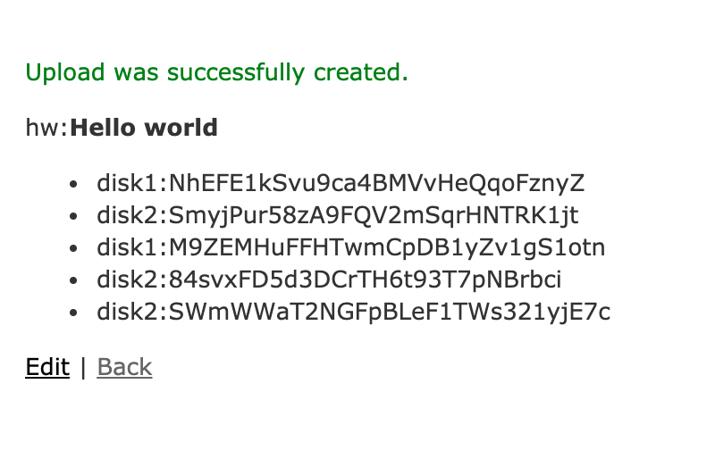
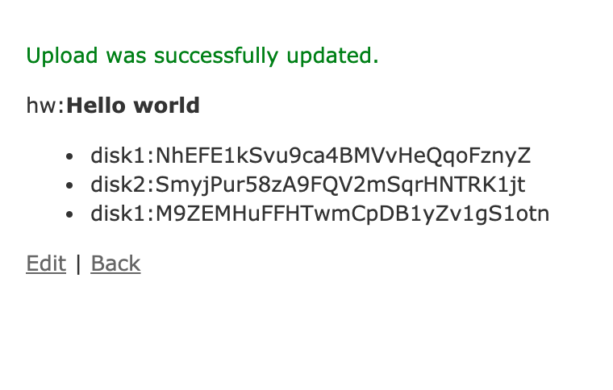

A demo application using the [activestorage-horcrux
gem](https://github.com/johncallahan/activestorage-horcrux) to
distributed shares of attachments across multiple storage services
using Shamir Secret Sharing (via the [tss-rb
gem](https://github.com/grempe/tss-rb)).  Use it in your storage.yml
file.  It is not a mirror, but can be named as a storage service.

Compatible with the [lockbox gem](https://github.com/ankane/lockbox).

```ruby
# in storage.yml
disk1: 
  service: Disk
  root: "tmp/disk1"

disk2:
  service: Disk
  root: "tmp/disk2"

horcrux:
  service: Horcrux
  shares: 5
  threshold: 3
  prefix: true
  services: [ disk1, disk2 ]
```

# Examples

After cloning, creating the database, migrating and starting up the
server, visit the app root page (typically at http://localhost:3000 in
local development or use 'heroku open' when deployed to Heroku).
Then, create a new upload.  Call it "hw" and attach the helloworld.txt
file in the demo subdirectory:


***

If successful, you will see five keys for five shares prefixed with
their storage locations. (HINT: save the deleted keys somewhere for
safe keeping!) You will also see the reassembled (and decrypted)
attachment contents ("hello world"):


***

You can edit the keys by clicking 'Edit':


***

and remove (just delete the form field contents) the last two keys)
and click 'Update Upload' leaving three of the five keys:


***

Since you still have three of five keys (three is the minimum
threshold), reassembly (and decryption) will still work:


***

However, if you edit and remove the 3rd key:


***

So that only two of the five keys remain:


***

then there will not be enough shares to reassemble!  HINT: edit the
keys are replace them with at least three of the five keys to regain
access.


# Local development

You must have postgres available.  Works with the [lockbox
gem](https://github.com/ankane/lockbox) and use the LOCKBOX_MASTER_KEY
below for development only.

```shell
% git clone git@github.com:johncallahan/activestorage-horcrux-example.git
% cd activestorage-horcrux-example
% export LOCKBOX_MASTER_KEY=0000000000000000000000000000000000000000000000000000000000000000
% bundle install
% rake db:create
% rake db:migrate
% rails s
```

Then visit http://localhost:3000

# Heroku deployment

[](https://heroku.com/deploy)

# To-do/Issues

* Heroku deploy button
* API examples
